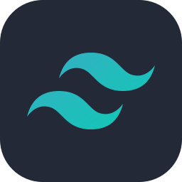

<!-- fpoleo -->

  
  
  
  
  
  
  
  
  
  
  
  
  
  
  
  
  
  
  

### Hi, I'm Fran 👋

I'm **Francisco "Fran" Poleo**, a software engineer with 14 years across frontend and architecture, mostly shipping product in regulated finance and digital identity. Today I'm a **Senior Software Engineer** on the Credit Card team at **Santander UK**, building React Native features in TypeScript, XState and TailwindCSS, and refactoring legacy code into modules that are easier to maintain.

**Current focus.** I work hands-on with agentic development and coding agents: I designed a shared instruction set that any repository can adopt with a few lines in its `AGENTS.md`, plus a VS Code agent preloaded with a project's architecture docs, roles and glossary. I'm going deeper into applied AI engineering — production Python, RAG and retrieval, evaluation and observability, MCP, guardrails and agent reliability.

**What I want to be known for.** Shipping reliable AI features where the model is one fuzzy component of a system that still has to be fast, affordable and safe — and for turning fuzzy quality into tests you can re-run. I bring 14 years of architecture, a regulated-industry instinct for security and compliance, and a systems view that reaches beyond the browser.

**Links:** [GitHub](https://github.com/francjpd) · [LinkedIn](https://www.linkedin.com/in/francisco-poleo-77b68027/)

  
<small>If you liked the style from my profile and wanted to have a similar one, feel free to fork it. I would very much appreciate it if you starred it</small>

<!-- Francjpd -->
